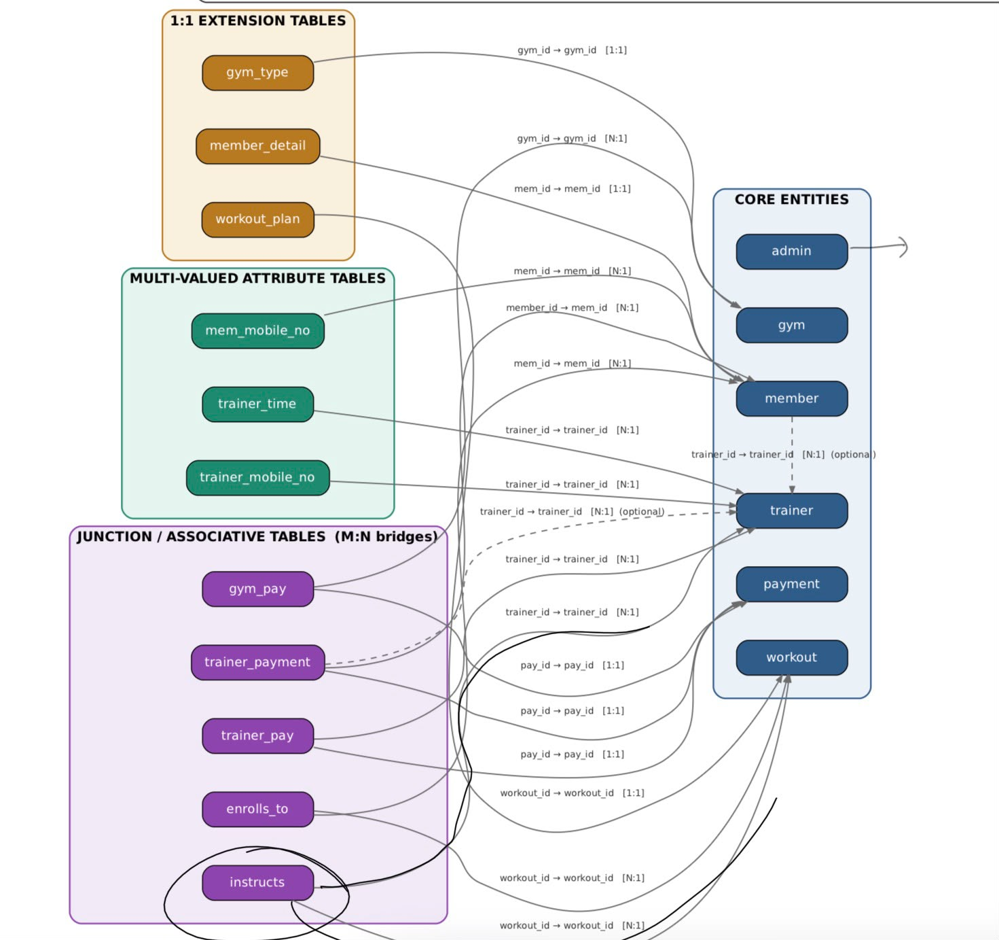

# 🏋️ Gym Management System — MySQL Database

A **MySQL-based Gym Management System** designed to manage members, trainers, workouts, gyms, and payments through a normalized relational database.

## 📌 Project Highlights

* **Designed a normalized relational schema with 13+ interconnected tables**, using primary/foreign keys, composite keys, constraints, and cascading actions to maintain data integrity and support efficient, maintainable querying.
* **Implemented stored procedures, user-defined functions, and triggers** for business logic, validation, automated calculations, and relationship management.
* **Developed SQL reporting logic using complex JOINs, subqueries, and relational queries** to extract operational insights across members, trainers, workouts, and payments.
* Implemented **many-to-many relationships** for trainer-workout assignments and member-workout enrollments.
* Added database-level validation for **non-negative payments and unique mobile numbers** using triggers.
* Implemented reusable functions for **member age calculation and workout-count analysis**.
* Created a stored procedure to **validate and assign trainers to workouts** while preventing duplicate assignments.
* Used `ON DELETE CASCADE` and `ON DELETE SET NULL` to maintain **referential integrity** across dependent entities.

---

## 🗂️ Database Structure

The database is named:

```sql
gymdb
```

### Core Tables

| Table               | Purpose                                  |
| ------------------- | ---------------------------------------- |
| `admin`             | Stores administrator login credentials   |
| `gym`               | Stores gym information and address       |
| `gym_type`          | Stores gym classification                |
| `payment`           | Stores payment amounts                   |
| `gym_pay`           | Associates payments with gyms            |
| `trainer`           | Stores trainer information               |
| `trainer_pay`       | Associates trainers with payments        |
| `trainer_mobile_no` | Stores trainer phone numbers             |
| `trainer_time`      | Stores trainer availability              |
| `member`            | Stores member information                |
| `member_detail`     | Stores additional member details         |
| `mem_mobile_no`     | Stores member phone numbers              |
| `trainer_payment`   | Tracks trainer-related member payments   |
| `workout`           | Stores workout information               |
| `workout_plan`      | Stores workout schedules and repetitions |
| `instructs`         | Maps trainers to workouts                |
| `enrolls_to`        | Maps members to workouts                 |

---

## 🧱 Relational Schema Design

The database follows a **normalized relational design**, separating entities and relationship tables to reduce redundancy and improve data integrity.



### Member → Trainer

```text
MEMBER ──────────── TRAINER
```

Each member can be assigned a trainer through the `trainer_id` foreign key.

### Member ↔ Workout

A member can enroll in multiple workouts, while a workout can have multiple members.

```text
MEMBER
   │
   ▼
ENROLLS_TO
   ▲
   │
WORKOUT
```

### Trainer ↔ Workout

Trainers can instruct multiple workouts and workouts can be assigned to multiple trainers.

```text
TRAINER
   │
   ▼
INSTRUCTS
   ▲
   │
WORKOUT
```

These many-to-many relationships are implemented using dedicated junction tables.

---

# ⚙️ Database Logic

## Stored Procedure — `AssignTrainerToWorkout`

The procedure assigns a trainer to a workout while validating both entities.

```sql
CALL AssignTrainerToWorkout(1,1);
```

It:

1. Checks whether the trainer exists.
2. Checks whether the workout exists.
3. Inserts the relationship into `instructs`.
4. Prevents duplicate assignments using `INSERT IGNORE`.

Invalid trainer IDs or workout IDs generate descriptive SQL errors using `SIGNAL SQLSTATE`.

---

# 🧮 User-Defined Functions

### `getAge()`

Calculates a member's current age from their date of birth.

```sql
SELECT getAge('2001-01-09');
```

### `TotalWorkouts()`

Returns the number of workouts a member is enrolled in.

```sql
SELECT TotalWorkouts(1);
```

These functions encapsulate frequently used business logic and make queries more reusable.

---

# 🚨 Triggers

### Non-negative Payment Trigger

`trg_payment_nonneg` validates payment amounts before insertion.

If a negative amount is entered, it is automatically converted to `0`.

### Unique Mobile Number Trigger

`trg_unique_mobile` prevents duplicate member mobile numbers from being registered.

If a duplicate number is detected, the database raises:

```text
Mobile number already registered
```

This moves important validation logic into the database layer rather than relying entirely on application code.

---

# 📊 SQL Reporting & Analytics

The database can be queried to generate operational reports across membership, workouts, trainers, and payments.

### Member–Trainer Report

```sql
SELECT
    m.mem_first_name,
    m.mem_last_name,
    t.trainer_first_name,
    t.trainer_last_name
FROM member m
LEFT JOIN trainer t
ON m.trainer_id = t.trainer_id;
```

### Member Workout Report

```sql
SELECT
    m.mem_first_name,
    m.mem_last_name,
    w.workout_name
FROM member m
JOIN enrolls_to e
ON m.mem_id = e.mem_id
JOIN workout w
ON e.workout_id = w.workout_id;
```

### Trainer Workout Report

```sql
SELECT
    t.trainer_first_name,
    t.trainer_last_name,
    w.workout_name
FROM trainer t
JOIN instructs i
ON t.trainer_id = i.trainer_id
JOIN workout w
ON i.workout_id = w.workout_id;
```

The schema can be extended with **views, subqueries, aggregation, and multi-table JOINs** to build reports for:

* Membership activity
* Workout enrollment
* Trainer assignments
* Payment and revenue analysis
* Gym-wise payment summaries
* Member engagement

---

# 🔑 Key DBMS Concepts

This project demonstrates practical use of:

* Relational schema design
* Database normalization
* Primary keys
* Composite primary keys
* Foreign keys
* Referential integrity
* One-to-one relationships
* One-to-many relationships
* Many-to-many relationships
* `JOIN`
* Subqueries
* Views
* Aggregate functions
* Stored procedures
* User-defined functions
* Triggers
* `SIGNAL SQLSTATE`
* `INSERT IGNORE`
* `ENUM`
* `DECIMAL`
* `AUTO_INCREMENT`
* `ON DELETE CASCADE`
* `ON DELETE SET NULL`

---

# 🚀 How to Run

### 1. Install MySQL

Use MySQL Server with a client such as:

* MySQL Workbench
* phpMyAdmin
* MySQL CLI

### 2. Open the SQL file

Open:

```text
gym_management.sql
```

### 3. Execute the complete script

The script automatically:

* Creates `gymdb`
* Drops previous tables
* Creates the relational schema
* Creates functions
* Creates the stored procedure
* Creates triggers
* Inserts sample data
* Assigns trainers to workouts

### 4. Verify the database

```sql
USE gymdb;
SHOW TABLES;
```

---

# 📁 Project Structure

```text
Gym-Management-System/
│
├── README.md
├── gym_management.sql
└── SCHEMA.jpeg
```

---

# 🔮 Future Improvements

* Password hashing and authentication
* Membership subscription management
* Attendance tracking
* Membership expiry tracking
* Monthly revenue dashboards
* Trainer salary management
* Workout progress tracking
* Role-based access control
* REST API integration
* Web-based admin dashboard

---

## 🎯 Project Summary

The project demonstrates the design and implementation of a **normalized relational database for gym operations**, combining structured entity modeling with database-level business logic. It uses **13+ interconnected tables, stored procedures, functions, triggers, complex JOINs, and reporting queries** to provide a maintainable foundation for membership, trainer, workout, and payment management.
